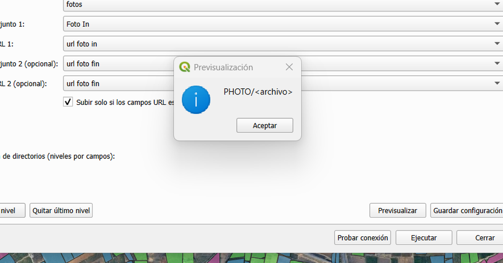
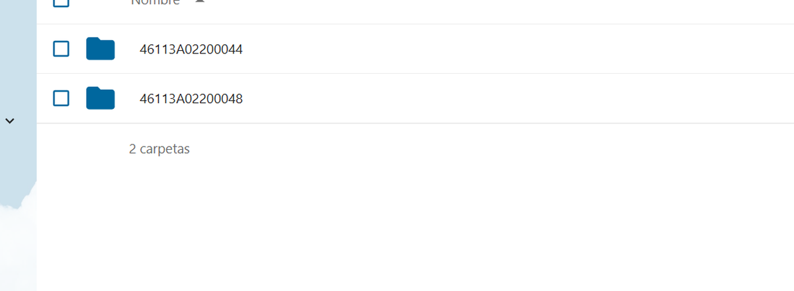

# QField Nextcloud Uploader

QGIS / QField plugin for automated upload and structured organization of field attachments to Nextcloud / WebDAV servers.

---

## Plugin Interface

---

## Upload Process

---

## Dynamic Folder Structure

---

## Nextcloud Result

---

## Problem Addressed

Field workflows often generate large volumes of photos and attachments that must be manually copied, renamed, and organized. This process is error-prone, time-consuming, and inconsistent across teams.

## Key Features

- Automated attachment upload
- Structured remote folder creation
- Nextcloud / WebDAV compatibility
- Retry logic for unstable connections
- Optimized bulk transfers
- Designed for real QField workflows

## Typical Use Cases

- Environmental surveys
- Forestry operations
- Field inspections
- Technical site documentation
- Any QField-based data collection project

## Status

Commercial plugin. Demonstrations or evaluation builds available upon request.

## Contact

For licensing or demo requests:  
jfabiomartinez@gmail.com
